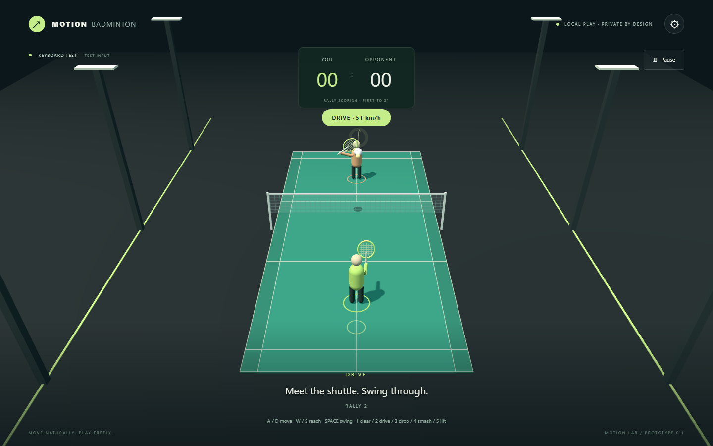

# Human vs Fruit-Fly Connectome Badminton

A scientifically grounded, playable local singles badminton experience: your webcam tracks your upper-body intent from where you stand, while your opponent is driven by computational neural dynamics constrained by a **real Drosophila connectome (Janelia MaleCNS v1.0)**.

The experience features an active **Leaky Integrate-and-Fire (LIF)** network simulation operating over the biological connectome wiring diagram, accompanied by a real-time **Connectome Lab** visualizer and optogenetic intervention suite.

No accounts, cloud inference, external API keys, or video uploads. Runs 100% locally in your browser.



---

## Key Innovations

### 1. Zero-Scripted Drosophila Opponent

- **Empirical Connectome Graph**: Uses the official HHMI Janelia MaleCNS v1.0 dataset (`male-cns:v1.0`) containing **2,439 biologically annotated sensorimotor neurons** and **44,781 directional biological edges** (**1,146,043 biological synapses**) with 100% authentic Janelia body IDs.
- **Leaky Integrate-and-Fire (LIF) Simulation**: Implements continuous biophysical membrane potential dynamics, exponential synaptic conductances, absolute refractory periods, and biological neurotransmitter signs (+1 ACh, -1 GABA/Glu) following Shiu et al. (_Nature_ 2024).
- **Optical Sensory Transduction**: Transforms 3D shuttle trajectory into spherical retinal coordinates, looming angular expansion rates ($\eta(t)$), and retinotopic visual projection neuron (`LC4`, `LC6`, `LC10a/b`, `LPLC1/2`) inputs.
- **Descending Motor Decoding**: Decodes asymmetric population rates of descending neurons (`DNa01`/`DNa02` lateral steering, `DNp01` forward thrust, `DNb01`/`GF` strike triggers) directly into continuous flight kinematics ($v_x, v_z$).
- **Swept Physical Contact & Zero Proximity Shortcuts**: Outgoing shots derive from genuine swept racket contact mechanics and contact point kinematics. The fly can miss if neural steering or stroke timing is misaligned.
- **Dual Opponent Mode**: Toggle freely between the **Fruit-Fly Connectome** and the baseline **Classic AI**.

### 2. Live Connectome Lab & Optogenetic Interventions

- **Interactive 3-View Neural Visualizer**:
  - _Circuit Flow View_: Hierarchical signal propagation from Optic Lobe $\rightarrow$ Central Complex $\rightarrow$ Descending Pathways $\rightarrow$ VNC Motor Effectors with live active signal pathway tracing.
  - _Spatial View_: 3D anatomical layout of the fly brain in authentic Janelia EM voxel coordinates.
  - _Spike Raster & Oscilloscope_: Real-time spike rasters and population firing rate traces.
- **Real-Time Interventions**:
  - _Silence Looming (LC4/LC6/LPLC)_: Optogenetically silences collision detection; test if the fly misses incoming high-speed shots!
  - _Silence Steering (DNa02)_: Inhibits lateral motor turning pathways.
  - _Silence Strike Trigger (DNb01/GF)_: Prevents racket swing execution.
  - _Synaptic Gain & Sensory Drive Sliders_: Dynamically scale network excitability.

### 3. Intent-Based Human Control Model

- **Play from where you stand**: Designed for real physical play in a ~1m × 1m space.
- **Auto-Footwork & Body Intent**: The virtual player avatar handles court traversal automatically. Subtle torso leans and reach directions bias speed, court positioning, and shot placement.
- **3-Stage Fast Calibration**: 3–5 second calibration (Center $\rightarrow$ Racket Hand $\rightarrow$ Extended Reach) with no room traversal required.

---

## Quick Start (Windows / macOS / Linux)

Prerequisites: Node.js 22+ and Git. Recommended: Google Chrome or Microsoft Edge with hardware acceleration enabled.

```powershell
git clone https://github.com/manasvignesh/Lol.git
cd Lol
npm ci
npm run setup
npm run dev
```

Open **http://127.0.0.1:5173**.

For an optimized production build:

```powershell
npm run build
npm run preview
```

---

## Scientific Documentation

- [docs/NEUROSCIENCE.md](docs/NEUROSCIENCE.md): Comprehensive biophysical formulation, LIF equations, sensory encoding math, motor decoding, and scientific honesty boundaries.
- [docs/CONNECTOME_DATA.md](docs/CONNECTOME_DATA.md): Connectome CSR matrix binary format, schema, MaleCNS v1.0 GCS extraction pipeline, and dataset reproduction.
- [docs/ATTRIBUTION.md](docs/ATTRIBUTION.md): Citations and credit for HHMI Janelia MaleCNS v1.0, FlyWire, and open-source packages.
- [docs/ARCHITECTURE.md](docs/ARCHITECTURE.md): System architecture, Web Worker execution pipeline, and state synchronization.
- [docs/VALIDATION.md](docs/VALIDATION.md): Automated verification suite and acceptance testing record.

---

## How to Play

1. Click **Play with Camera** and allow webcam access.
2. Complete the 3-second calibration:
   - **Step 1:** Stand centered and relaxed.
   - **Step 2:** Raise only your racket hand above shoulder level.
   - **Step 3:** Extend your racket arm comfortably.
3. **Serve**: Make a deliberate, gentle upward swing.
4. **Rally**: Swing naturally as the shuttle approaches. Torso leans steer your avatar; forearm trajectory directs shot type (Clear, Drive, Drop, Smash, Lift).
5. **Connectome Lab**: Click the **🧠 CONNECTOME LAB** button in the header or HUD to open the live neural visualizer and experiment with optogenetic silencing during live rallies!

---

## Keyboard Controls (Test Mode)

| Key                   | Action                                     |
| :-------------------- | :----------------------------------------- |
| **A / D**             | Steer player avatar left / right           |
| **W / S**             | Adjust racket reach height                 |
| **Space**             | Swing racket / Serve                       |
| **1 / 2 / 3 / 4 / 5** | Clear / Drive / Drop / Smash / Lift intent |
| **Escape**            | Pause / Resume                             |

---

## Verification & Testing

```powershell
# Run 43 automated unit and integration tests
npm test

# Verify MaleCNS v1.0 biological graph integrity
npm run validate:connectome

# Typecheck and build verification
npm run typecheck
npm run build

# Format check
npm run format:check
```

---

## License & Attribution

- Connectome data adapted from HHMI Janelia MaleCNS v1.0 and FlyWire (_Nature_ 2024).
- MediaPipe Pose Landmarker: Apache-2.0.
- Three.js: MIT License.
