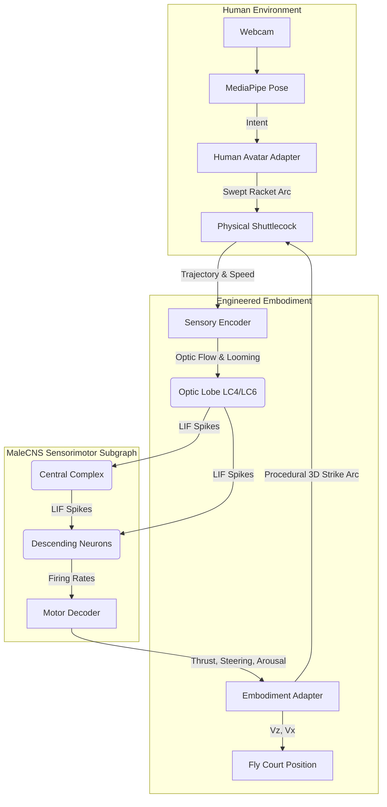

# Human vs Fruit-Fly Connectome Badminton

A scientifically grounded, playable local singles badminton experience: your webcam tracks your upper-body intent from where you stand, while your opponent is driven by computational neural dynamics constrained by a **real Drosophila connectome (Janelia MaleCNS v1.0)**.

The experience features an active **Leaky Integrate-and-Fire (LIF)** network simulation operating over a MaleCNS-derived sensorimotor subgraph, wrapped in an engineered badminton embodiment.

No accounts, cloud inference, external API keys, or video uploads. Runs 100% locally in your browser.


---

## Executive Summary

This project simulates a biological fruit-fly sensorimotor pathway attempting to play a virtual game of badminton against a human player via a webcam.

The application translates the 3D trajectory of the virtual shuttlecock into spherical retinal visual currents, feeds them through an authentic, topologically correct subset of the Janelia MaleCNS v1.0 connectome graph (2,439 neurons, 44,781 edges, 1,146,043 biological synapses), and decodes the resulting descending motor population rates. These abstract biological signals are then handed off to an engineered **Embodiment Adapter** which bridges the gap between biological intent (locomotion, steering, escape bursts) and physical court mechanics (racket strokes, physical reach, footwork).

---

## Real vs Engineered Distinctions

| Component                 | Biological (MaleCNS v1.0 Derived)                                           | Engineered (Game Logic / Virtual Avatar)                                      |
| :------------------------ | :-------------------------------------------------------------------------- | :---------------------------------------------------------------------------- |
| **Input / Vision**        | Senses looming visual patterns via engineered spherical retinal projection  | Shuttlecock trajectory prediction, physical court bounds                      |
| **Network Architecture**  | 2,439 real neurons, 44,781 biological edges, accurate body IDs & cell types | LIF dynamics, constant conductance factors, discrete time steps               |
| **Output / Motor**        | DNa01/DNa02 (steering), DNp01/VNC (thrust), MDN (braking), DNb01 (saccade)  | Avatar movement (Vx, Vz), procedural 3D racket swing arc                      |
| **Gameplay Interactions** | None directly. No concept of a "racket" exists in the connectome graph.     | Swept physical racket collision, human ghost-hit prevention, 3D court physics |

### Is it trained?

**No.** There is no machine learning, no backpropagation, and no genetic algorithms used to adjust synaptic weights for gameplay performance. The graph structure and synaptic weights are derived directly from the empirical Janelia MaleCNS v1.0 dataset. Game balance is achieved entirely through careful tuning of the engineered sensory encoder (input scaling) and embodiment adapter (output physical limits).

---

## Data Sources

The project relies exclusively on the **HHMI Janelia MaleCNS v1.0** dataset for its biological graph data and morphology.

- **FlyWire** is **not** used in this iteration of the execution runtime.
- The extracted subgraph contains precisely 2,439 neurons (1,158 visual, 138 central complex, 702 interneurons, 186 descending, 255 VNC motor effectors).

---

## Pipeline Diagram



---

## Technical Nuances

### Human Control Model

The human player uses a webcam. Control is rooted in **physical swept collisions**.

- **Intent-Based Footwork**: Lean left/right or step forward/back to guide the avatar. The avatar automatically targets the nearest viable intercept point, but your lean acts as an override.
- **Strict Collision Geometry**: The avatar will **not** auto-hit the shuttle. You must generate a verified swing (e.g., racket velocity over a threshold) whose swept path physically intersects the shuttle's radius. Hand-waving gestures away from the shuttle are strictly ignored.

### Fruit-Fly Control Model

The biological simulation is bridged by the **Embodiment Adapter**:

- **Deep Court Retreat**: When a high, deep shot passes over the fly, the biological arousal and braking drives modulate an engineered backward retreat targeting a comfortable descending strike height (1.45m).
- **Two Modes**:
  - `demo-assist` mode widens the fly's physical reach window and speeds up movement to make the game feel like a continuous rally.
  - `scientific` mode applies tighter motor constraints and stricter timing windows, drastically lowering the successful return rate but reflecting a more rigid mapping.

---

## In-Silico Interventions & Validation

The application features a real-time **Connectome Lab** visualizer that traces LIF population firing rates. You can trigger live _in-silico interventions_ to observe behavioral changes:

- **Silence Looming (LC4/LC6/LPLC)**: Blocks collision detection. The fly will fail to react to fast incoming shots.
- **Silence Steering (DNa02)**: Inhibits lateral motor pathways. The fly will struggle with wide cross-court shots.

The biological extraction is verified via an automated test suite (`npm run validate:connectome`) enforcing precise counts for synapses (1,146,043) and edges (44,781).

---

## Quick Start

Prerequisites: Node.js 22+ and Git.

```powershell
git clone https://github.com/manasvignesh/Lol.git
cd Lol
npm ci
npm run setup
npm run dev
```

Open **http://127.0.0.1:5173**.

---

## Documentation

- [docs/NEUROSCIENCE.md](docs/NEUROSCIENCE.md): In-depth LIF mathematics and biological demarcations.
- [docs/CONNECTOME_DATA.md](docs/CONNECTOME_DATA.md): Data extraction details.
- [docs/ARCHITECTURE.md](docs/ARCHITECTURE.md): Frontend system and state pipeline.
- [docs/VALIDATION.md](docs/VALIDATION.md): Telemetry and verification processes.
- [docs/ATTRIBUTION.md](docs/ATTRIBUTION.md): Citations.

---

_Connectome data adapted from HHMI Janelia MaleCNS v1.0. MediaPipe Pose Landmarker: Apache-2.0. Three.js: MIT License._
